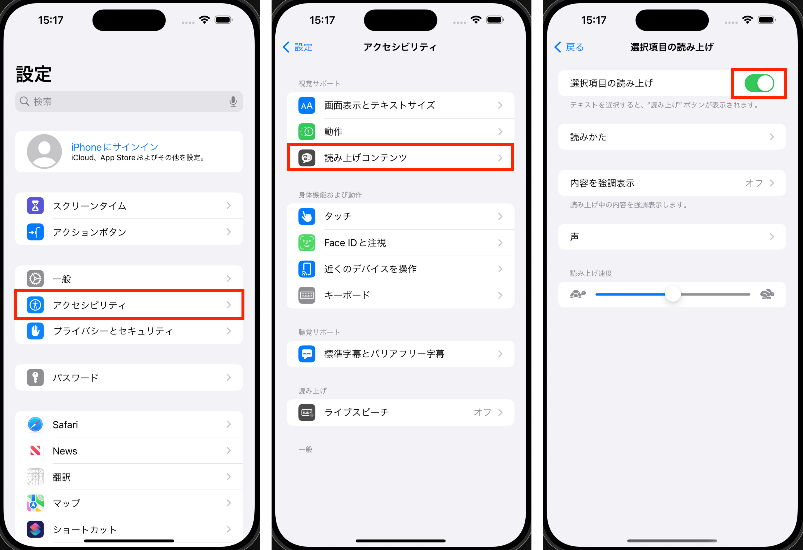
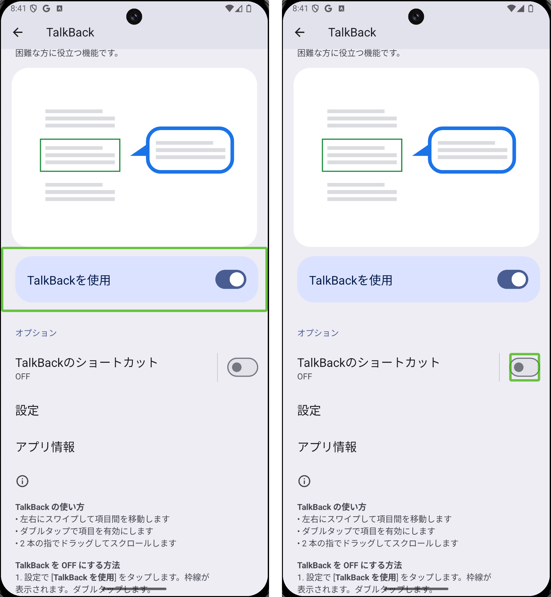
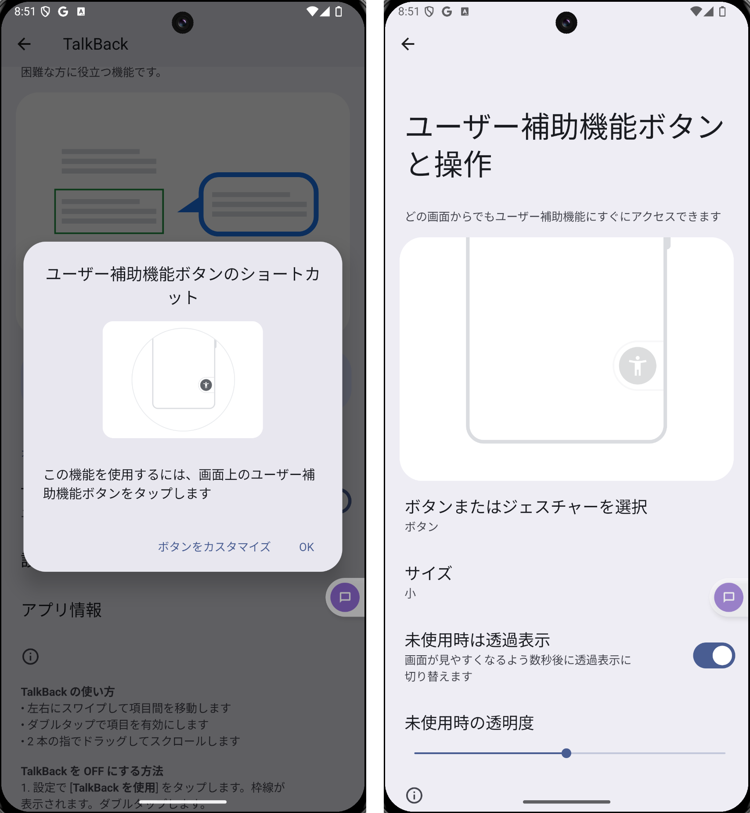
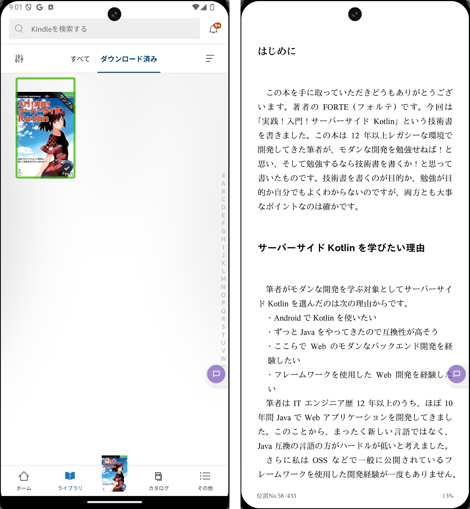

## 緑内障になってから変わった心境とインプット方法

<strong>李東憲 (DongHeon Lee) X: @camomile_cafe &amp; github: @LeeDDHH</strong>

## はじめに

本章を執筆した camomile_cafe です。初めての方が多いと思いますので簡単に自己紹介をさせてください。  
韓国から日本に留学生で来てからかれこれ 12 年くらい経つ者です。  
大学では情報学部とは全然違う学問を専攻して社会人になってからエンジニアになったケースの人です。  
社会人になってからエンジニアとしての仕事を始めたこともあり、PC と向かって独学で勉強したり、勉強会に顔を出して知見を得たりしてキャリアを積んできました。

そんな自分ですが、ここ最近眼科で検査を受けた際に緑内障の診断を受けました。  
そういう目の病気はまだ先の話かなと思っていたところ、自分にもそういうことがおきたことで、いろいろと心境や行動に変化が起きました。  
今回は、緑内障になったことによる心境の変化や普段の生活において見方が変わったこととそこから学んだことについて紹介したいと思います。

### 緑内障の発覚

自分は眼科でコンタクトレンズ着用の検査を 3 回ほど受けましたが、その都度「眼圧が高い」と診断され、コンタクトレンズをつけることができませんでした。  
今度こそ着用できるだろうと思い、今年の 5 月に眼圧が正常になったと眼科で診断を受け、これからはメガネをかけずに出かけられると嬉しく思っていましたが、眼科で別の検査も一緒に受けた際に先生から緑内障であると診断されました。

普段モニターに張り付いて目を酷使するような仕事をしているため、眼精疲労を感じることが多く、いつかは目に関する病気を経験するだろうと思っていましたが、30 代で緑内障と診断されるのは予想外で突然のことでした。

緑内障について調べてみると、どうやら 40 歳以上の**20 人に 1 人が緑内障**だと診断されているそうです。[^1]

[^1]: <https://www.jaaikosei.or.jp/magazine/1221/>

眼科の先生によると、この「20 人に 1 人」というのは、実際に眼科で診断された人の割合であり、眼科を受診していない人も含めると、実際の罹患率は**20 人に 3〜4 人**、あるいはそれ以上である可能性もあるとのことです。  
健康診断では見つかりにくい病気であるため、実際の罹患率は高いと考えられます。

また、緑内障は日本で**中途失明の原因の第 1 位**とされている目の病気です。[^2]  
緑内障は、目と脳をつなぐ視神経がダメージを受けることで、徐々に視野が狭くなり、最悪の場合失明に至ることがあります。  
初期段階では自覚症状がほとんどないため、気づかないうちに進行してしまうことが多いです。  
視野が欠けてくるという特徴的な症状が現れたときには、すでに進行していることが多いのです。  
緑内障の原因は多岐にわたりますが、自分の場合は眼圧が高いために視神経が圧迫され、徐々に視野の見えている部分が狭まるタイプでした。

[^2]: <https://www.nhk.jp/p/kyonokenko/ts/83KL2X1J32/episode/te/6PV36ZZ8NN/>

緑内障の治療法としては、眼圧を下げるための点眼薬や内服薬、レーザー治療、手術などがあります。  
ただ、治療とはいえ、眼圧の上昇によって**一度障害されてしまった視神経の修復は困難**とされます。 [^3]  
つまり、緑内障は完治する病気ではなく生涯にわたり視機能を保つようにするために生涯通院することになります。  
自分の場合、たまたま早期に発見できたことと眼圧を下げるための点眼薬を投与することで進行の具合を抑えられる段階でして、これから定期的な眼科検診を受けながら過ごすことになりました。  
振り返ってみると、もし検査を受ける機会がなければ、緑内障とは知らずに「目が疲れているな」と感じるだけで、徐々に視力が失われていったかもしれないです。

[^3]: <https://www.daiyukai.or.jp/department/ganka-ryokunaisho#h30>

そこで、これを読んでいる読者の皆さんには、特に 20 代や 30 代の方で、**最近眼精疲労を感じる**、**目の異常を感じる**など、何らかの異常を感じたら、ぜひ眼科に行って緑内障検査を受けることを強くおすすめします。

### 目の病気があることを受け入れる

一生使う目が病気になるという経験は初めてで、放心したりやけになったりするかと思いましたが、案外自分が緑内障だと診断されたことについて受け入れるのが早かったです。

心理学には、喪失体験がもたらす「喪失の五段階」というプロセスがありますが、自分はそのプロセスが早く収束したように感じました。  
喪失の五段階とは、エリザベス・キューブラー＝ロスが 1969 年に提唱した喪失体験のモデルで死や重大な病気を経験した人々の感情のプロセスを理解するためのものです。現在では本人の病気や失業による役割の喪失なども含めた様々な種類の喪失体験にも応用されています。 [^4]

[^4]: <https://www.jamh.gr.jp/kokoro/147_kan.html>

具体的には、それぞれの段階で以下のような経験をします。

- **否認**
  - 「こんなことが起きるなんてありえない！」と現実を否定する段階。
- **怒り**
  - 「なんで私がこんな目に遭わなければならないのか！」と怒りを感じる段階。
- **取引**
  - 「何でもしますのでどうか助けてください！」と取引しようとする段階。
- **抑うつ**
  - どうしようもない現実に対して深い悲しみや抑うつを感じる段階。
- **受容**
  - 現実を受け入れ、前向きに生きていこうとする段階。

自分の場合、この喪失の五段階のうち、四段階までが驚くほど早く過ぎ去りました。  
現実の否定から抑うつ感を覚えるところまで、体感として 1 日もかからなかったのです。  
普段健康的な生活を心がけるため、早朝から歩いたり、こまめに目を休ませたりする習慣があったので、最初は何かの間違いだと思っていました。  
これまでの努力が無駄だったのかとイライラしたり、何をすればよかったのかと考えたりしました。  
毎日健康管理をしても病気になるときはなるんだと思い、抑うつを感じながらも自分の現状について理解しようと努め、これからのことをどう考えるべきか悩んだりもしました。

この時に思ったのは、**体の調子や病気は自分の理解を超えた何かによって訪れる**ということです。  
エンジニア的な表現で例えるならば、人の身体はあらかじめプログラミングされていて、遺伝や生活習慣で多少の変化は加えられるものの、大きな出来事が起きるシナリオは変えられないという感覚を覚えました。

今回もそのような感覚でいられたことで、喪失の五段階のうち、四段階目まで早く進むことができたのではないかと思いました。

### 次は何をするのかについて考える

喪失の五段階のうち、四段階までは自分の中で消化したものの、一番難しかったのは五段階目の**受容**でした。  
仕事やプライベートにかかわらず、生活の中で目に依存してやってきたことがいかに多いのかをしみじみと感じ、それらができなくなるのが恐ろしいと思いました。  
キャリア、物理的な移動、新しい知識のインプットなど、目から受け取る情報の多さと、それが享受できなくなることを考えると、**目が見えなくてできないことが増えることについていかに自分が納得できるか**が一つの大きな問いとなりました。

ただ、まったく答えが見つからない問題かというとそうでもないと思いました。  
というのも、緑内障はある日突然目が見えなくなるわけではなく、目の見えない部分が徐々に広がる病気です。  
現代医学で治すことはできないものの、緑内障の症状を遅らせることはできます。  
つまり、最悪のパターンとして失明によってまったく見えない状況を考えるべきですが、それに至るまでの過程で**見えている部分が多い・少ないときにやれること・できること**についてフォーカスを当てて考えると、少なくとも次にやることは決められるのではないかと思いました。

例えば、「キャリア・仕事をどうするのか」に関して、エンジニアとしてやってきた経歴を活かし続ける場合、緑内障の後期・末期や失明までは見える部分が半分以上あるので今の仕事を続けることができると考えました。  
コーディング、コードレビュー、仕様書の確認と作成、コミュニケーションツールの利用など、目に依存する割合が多い業務に関しても、緑内障の中期でも両目で視野を補っているため、モニターから文字を見ることは可能です。  
また、緑内障の進行度にもよりますが、障害者雇用として IT 業務のサポートに就くことも手段の一つです。  
開発がメインではなくなったり、データ入力や急ぎではない仕事を担当したりするなど、これまでの業務とは異なるかもしれませんが、IT 業界の仕事には関わり続けることができる可能性があります。

ただ、後期・末期になると日常生活に支障をきたすほど視野の見えない部分が広がるので、その時はモニターを見なくてもいい仕事に就くのが良いかもしれないと思います。  
例えば、業種・職種ともエンジニアとは異なりますが、あはき師という選択肢もあります。  
「あはき」とは、あん摩マッサージ指圧、はり、きゅうの略称で、日本では国家資格免許を有する者がなることができます。[^5]  
免許取得には専門的な養成施設で一定期間のカリキュラムを修了し、国家試験に合格するという条件がありますが、免許を取得すると自宅開業や治療院・接骨院への就職が可能ですので、就業の手段として考えられます。

[^5]: <http://nichimou.org/employment/ahaki-work/>

ほかには、物理的な移動、新しい知識のインプットにおいて制約がかかった状態で生活することになりますが、考え方を変えるとこれからの行動において**制約がかかるほうに優先順位を上げて行動する**ことも可能だと思いました。  
「いつかやる」と決めていたことは多分そのときになればやると思いますが、自分の目で見てやることに関してはタイムリミットがかかった状態で、しかもそれがいつ訪れるか分からない状態で行動しないといけなくなります。  
そのため、いつか行こうと思っていたところに行けるように週末の計画を立てるとか、後で読もうと思っていた本を今のうちに読むみたいな考え方で**身軽にやる姿勢**は持てるようになったのではないかと感じます。

また、それらの活動をすることに**なにか意味を見出そうとする考え方**もより深く考えるようになりました。  
「いつかやる」と思っていたことを気軽にやることに加えて、同じ体験でも目が見えているときと徐々に見えなくなるときで体験の質が変わるだろうと考えました。  
人の五感はどこか一箇所の機能が衰えると別の感覚のほうが鋭くなると言われますが、目の見え方によって自分の感じ方も変わるだろうと思ったためです。  
目が見えているからこそ視覚情報による美しさの基準や色・形の好みが優先され、感じ方がある程度固定化されることがありましたが、これからは同じ体験でも視覚情報に依存しない感じ方をすることで新しい感覚が得られるのではないかという期待もあります。  
そのような感覚を得るためにも、目が見えているうちに「自分は目で見たときにこのような感じ方をするんだな」という**体験から感じ方の意味を導くこと**を大事にすることで、徐々に視覚情報に依存しない感じ方をしたとき、**自分が大事にすることやいいと思っていることの基準がさらにはっきりしていく**と思っています。

喪失の五段階の最後の段階で今までできていたことができなくなるという体験をこれからすることになる前提で「これからの仕事観」や「心境の変化にともなう感じ方の変化」について書いてみました。  
どちらも今までの価値観から別の価値観へシフトすることを前提に、自分はどう思ったのか、また次のプランとしてどんなことを考えたのかについて整理してみた結果、心身ともに変化が訪れても自分なりに大事にしたいことを導き出すための考え方は柔軟に変えられると感じました。  
緑内障の発覚は心境の変化としてはあまりポジティブではない経験でしたが、それでも生きていくために次は何をするのかを考える良い機会だったと改めて感じました。

## 少し変わってきた生活習慣

### 耳を使ったインプット

普段のインプットでは、目を使ったやり方がやはり多いのではないかと思います。  
実際、自分も本、電子書籍、ブログ、YouTube などから新しい情報を得ることが多いです。  
しかし、目の負担を減らすために、目を使わずにインプットできる方法があるといいなと思っていました。

そこで、現在使用しているスマホや PC のユーザー補助機能（アクセシビリティ機能）を使えば、目を使わずに情報をインプットする方法があるのではないかと調べてみました。  
ユーザー補助機能の中には**読み上げ機能**があり、目の不自由な方や視力の弱い方に対して補助的な UI を表示したり、音声で案内するフィードバックを提供するものがあります。  
スマホの機種によって有効化する機能名は異なり、iOS の場合は**読み上げコンテンツ**、Android の場合は**TalkBack**を有効にすることで使用できます。

iPhone の場合の設定方法

Android の場合の設定方法

自分が普段使っているデバイスは Android で TalkBack を使っていまして、iPhone の**読み上げコンテンツ**機能に関する詳細は割愛します。  
下記で説明するコンテンツの読み上げは kindle での使い方を例にしていますので、詳しく知りたい方は kindle の読み上げ機能を使用してコンテンツを聞く[^6]を参考にしていただければ幸いです。

[^6]: <https://www.amazon.co.jp/gp/help/customer/display.html?nodeId=G201829850>

Android の場合、TalkBack をオンにすると、どの UI 要素にフォーカスが当たっているのかを振動や色付きの枠で知らせてくれます。一度オンにすると、タップで UI の選択、ダブルタップでその UI 要素に対して一般的なタップ操作を行うことができます。

また、TalkBack を設定からその都度起動するのではなく、ユーザー補助機能ボタンのショートカットとして登録しておけば、読み上げ機能を使いたいアプリを起動してから即座に使用することもできます。

この状態で文字を読み上げてほしいアプリを起動し、ショートカットで TalkBack をオンにすると、文字として認識できるコンテンツであれば、読み上げてくれます。  
自分がよく使う Kindle の場合、「Text-to-Speech（テキスト読み上げ機能）」が有効になっている電子書籍であれば、読み上げ機能を使用することができます。

使い方のイメージとしては、Kindle を起動してから TalkBack を起動します。  
すると、以下のように電子書籍が選択された状態になりますので、ダブルタップすると電子書籍が開かれます。（例として挙げている書籍は Forte さんの『入門！実践！サーバーサイド Kotlin』[^7]です。）  
電子書籍が開かれた状態でダブルタップすると、TalkBack 機能でテキストを読み上げてくれます。  
読み上げのスピードや声のトーンは TalkBack の設定から調整できます。  
自分は中間よりも速めのスピードに設定することで、1 ページを 10 秒以内で読み上げられるようにしています。

[^7]: <https://www.amazon.co.jp/dp/B082H8GWMR>

読み上げ機能を知ってからは、積読していた本を少しずつ消化できるようになり、最近は通勤時によく活用しています。  
目を使わずに新しい情報をインプットできる点も大きなメリットですが、以下の 3 つのメリットも感じています。

- 読み上げを聞くことで、漢字の読み方を調べる回数が減少する
- 目が滑って、読んでいる途中で「どこまで読んだっけ？」という現象が起こらない
- 本を持たずに済むので、手の疲れが軽減される

そのため、電子書籍 1 冊分を読破するまでの時間が以前より遥かに短くなりました。  
以前は通勤で 1 日 1 時間半くらい読む時間があったとして、1 冊を読了するまでに通勤 4 回分が必要でしたが、読み上げ機能を使って聞き流すようになってからは、通勤 1.5 回分で 1 冊を読了できるようになりました。  
ただし、読み上げ機能は絵やイラストの説明を含まないため、完全に耳だけでインプットできるわけではありませんが、それでもテキストのインプット効率は体感で 2 倍以上あると感じます。

通勤中や仕事の合間に目を使わずにできるインプット方法として、スマホの読み上げ機能を活用すると、感じていた疲れは軽減されつつ、テキストのインプット効率も向上します。  
通勤や PC に向かっていないときに、ぜひ読み上げ機能を活用して「前から読みたいと思っていたあの本を聞き流す感覚でインプットする」という体験をしてみると、よりインプットを続けやすい生活ができるのではないかと思います。

### 目の負担が少ない画面にする

緑内障になってから目を使わずにインプットする方法を実践していますが、100%それに頼ることはできず、目で見て確認したり情報を得たりすることの頻度がまだまだ多いです。  
耳を使ったインプットでテキスト情報を聞き流していますが、それでは絵やイラストでの説明が分からないままで、ある程度は視覚情報を目にしないといけない場面もあります。  
そこで、目を使わざるを得ない状況であれば、できるだけ目の負担が減らせる方法でインプットしたほうが良いと思いました。

主に自分が使っている方法は 2 つあります。1 つ目は PC やスマホで読み物を見る際、できるだけ画面をグレースケールにして見ることです。  
グレースケールにする主なメリットは、色による刺激が軽減される点です。  
カラー画面は色による刺激が強く、画面の輝度を下げても長時間見続けることで目の疲れが生じることがしばしばありました。  
しかし、画面が白黒になると色のコントラストが低くなるため、目の負担はカラーでいろんな色を見るときよりかなり減ったと感じます。  
文章を読むときやチャットを見るときには、グレースケールで見るのがちょうど良いと思いました。

2 つ目は Mac の Night Shift を使う方法です。  
フロントエンドの仕事をしていると、どうしてもカラーで見る必要があるときがあります。  
その際は、時間制限を設けて一定時間まではカラーで見て、それ以上は色は見えるものの、目に優しくするという使い方をしています。  
目の疲れ具合でいうと、グレースケールにしたほうが効果はあると感じますが、Night Shift を使うことでブルーライトを制限する効果も感じられており、まったく使わないよりはマシだと感じました。

仕事をしているとモニターやスマホの画面を見る時間が長くなりがちで、どうしても目に負担がかかります。  
目の負担を減らすためにいろいろと工夫をしている中で、長時間使ってすぐにできる方法で効果が感じられたのは上記の 2 つであり、今も仕事・プライベートにかかわらず使用しています。  
自分のように画面と向き合う時間が長い方は、ぜひグレースケールと Night Shift を試してみてください。

### いつかやろうと思ったことを今やる

目がだんだん見えなくなっていくと分かってから、目の使い方を大事にする以外にできることがだんだん少なくなっていくだろうと思いました。  
特に目を使った体験については制限がかかるだろうと感じ、今のうちに良い景色を見に行ったり、誰かと話しに行ったりしたほうが後悔しないだろうと思いました。

自分の場合、緑内障だと診断されてから以下のようなことをしました。

- 前から行きたいと思っていた場所に行ってみる
  - 「THE RYOKAN TOKYO: 湯河原」に行き、「自分と向き合う専用ノートと一緒に泊まるパック」を利用する
  - 「おふろ cafe utatane」に行って、何もしない一日を楽しむ
- 会って話したいと思っていた人と話す
  - コロナ前に勉強会で会っていた方とオフラインで会い、話し合う
  - 韓国人のエンジニアの先輩や後輩と会って話し合う
  - 高円寺の飲み仲間と開拓していない店で飲み会をする

遠くへ行って得られる体験や、目が見えているからこそ楽しめることを経験したのはもちろんですが、それ以外にも**前からやってみたいと思っていたことや、どうするのが良いのか分からなかった抽象的なことが、次にやってみたいことや今後の方針として繋がる**ということがありました。

- THE RYOKAN TOKYO: 湯河原
  - 大学時代に教育実習生として接していた学校の生徒さんと偶然出会う
  - その生徒さんから「365 日日本一周絶景の旅」という本を知り、購入して次の旅行先として検討する
- おふろ cafe utatane
  - 「カメラはじめます！」という本に出会う
  - 読み進める中で、自分がやりたいのは写真をきれいに撮るよりも、撮った写真に補正をかけてきれいにしたいということが分かる
- コロナ前に勉強会で会っていた方とオフラインで会い、話し合う
  - SNS 上で交流があって近況を知ることはできたが、オフラインでの活動については新鮮な話題を聞く
  - 話の中で執筆する機会ができそうだったため、参加表明をする
- 韓国人のエンジニアの先輩や後輩と会って話し合う
  - 前から帰国してエンジニアの仕事をすることも考えたが、韓国のエンジニア事情について話を聞くことができた
  - 聞き終えてから、自分は日本語を使って現地の人と交流しながら仕事がしたい感覚が強いことが分かり、帰国して仕事をするのは当面考えないことにした
- 高円寺の飲み仲間と開拓していない店で飲み会をする
  - コロナ前はいつも集まって飲んでいたメンバーと久々に飲みに行き、何年も住んでいるのに一度も入ったことがない店に行く
  - 高円寺といえば酒のイメージがあったが、飲食店として美味しいところや全然知らない音楽の話を聞くことができる店が多く、まだまだ行ってみたい店が多いことが分かった

人との出会いには偶然な出来事もありましたが、ちょっとしたきっかけで行動を起こすことで、想定していたことに出会うことができました。  
ただ、このような出来事には、以前とは違って何かしらの行動をするたびに**その意味を考えたり、もう少し詳しく話を聞こうとする行動**を意識的に行っていたからこそ起きたことだと思います。  
緑内障が発覚し、はっきりと見える時間が限られてきたため、その間にできることと**今に集中すること**に時間を有効に使おうと意識するようになりました。そのおかげで、出来事に意味を見出したり、前から思っていたことに具体性を持たせたりするようになったと感じます。

振り返ってみると、今よりも時間的な余裕があり、目の健康を気にしなかったときにはやりたいと思っていたことを後回しにして他のことを優先してしまい、あまり活力のない生活をしていました。  
皮肉なことに、目の健康があまり良くない今、時間的な余裕もあまり感じられない中で、やりたいと思ったことをできるだけ行動に移し、活力を感じる生活ができるようになりました。  
きっかけはあまり良いとは言えない出来事から始まりましたが、これからも行動に移して次のやりたいことや抽象的に思っていたことに具体性を持たせることにつなげられる活力のある生活ができるといいなと思います。

## さいごに

海外で一人暮らしをしている中で突然目の病気が発覚し、最初はどうしたものかと思いました。  
しかし、体を酷使していた自覚はあったので、思っていたよりも早かったものの、いよいよ来たのかと受け入れるようになりました。

今回、自分が伝えたいことをざっとまとめると以下のようになります。

- 健康診断だけでは目の病気にかかっているかどうかが分からないので、眼科に行くべき
- 突然の病気が訪れても「自分ではコントロールできないことが起きた」と考え、「これからどうして生きたいのか」について考えると、時間とともに次にやるべきことややりたいことが見つかる
- 耳を使ったインプットを実践すると、目で読むよりも早いと実感した
- 目に優しい画面設定をして、目を大事にしよう
- 新しい体験をしに行くと、次にやりたいことが見つかり、前からやってみたいと思っていたことがより具体的になる体験につながる

目の健康が悪化したことをきっかけに、目の使い方を見直したり、見えなくなる未来に向けてこれから何をするのかについて自分なりにまとめることができました。皆さんも目を大事にしつつ、目を使わないインプットを実践してみてください。
